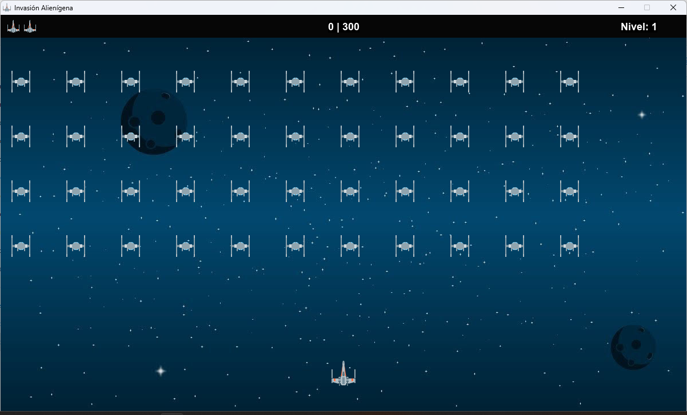

# Alien Invasion

Alien Invasion es un juego desarrollado en Python que intenta replicar la experiencia del clásico juego Space Invaders. El juego se construyó usando la biblioteca Pygame.

## Captura de Pantalla



## Características

- **Sprites de Aliens**: Los aliens se representan como sprites y se mueven de izquierda a derecha en la pantalla.
- **Chequeo de Bordes**: Los aliens verifican si han tocado los bordes de la pantalla y cambian de dirección.
- **Cargar Recursos**: El juego carga imágenes de aliens desde la carpeta de recursos.

## Requisitos

- Python 3.x
- Pygame

## Instalación

1. Clona este repositorio:
   ```bash
   git clone https://github.com/agustincomolli/alien-invasion.git
2. Navega al directorio del proyecto:
    ```bash
    cd alien-invasion
3. Instala las dependencias:
    ```bash
    pip install pygame
## Uso
Para ejecutar el juego, utiliza el siguiente comando:

   ```bash
    python alien_invasion.py
```

## Contribuciones
Las contribuciones son bienvenidas. Si deseas mejorar el juego, no dudes en enviar un pull request.

## Licencia
Este proyecto está licenciado bajo la Licencia MIT. Para más detalles, consulta el archivo LICENSE.

## Créditos
Agustín Comolli: Desarrollador principal 😁
